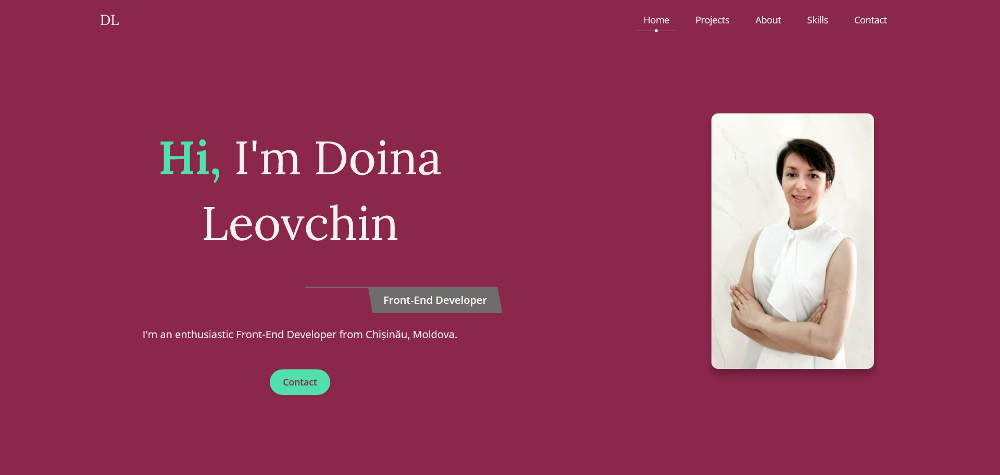

# Portfolio Website - Doina Leovchin

This is my final milestone after compliting the Front-End Developer Track at [Skillcrush](https://skillcrush.com/).

## Table of contents

- [Overview](#overview)
  - [The challenge](#the-challenge)
  - [Screenshot](#screenshot)
  - [Links](#links)
- [My process](#my-process)
  - [Built with](#built-with)
  - [What I learned](#what-i-learned)

## Overview

### The challenge

Users should be able to:

- View the optimal layout depending on their device's screen size
- Access the project's links

### Screenshot




### Links

- [Live site URL here](https://doileo.github.io/portfolio/)

## My process

### Built with

- Semantic HTML5 markup
- Flexbox
- CSS Grid
- Mobile-first workflow
- JavaScript

### What I learned

Throughout this project, I struggled and learned a lot. My first step was to decide how it would look, the fonts and colors to use, organize the markup document, and make it responsive. The biggest challenge was hiding the mobile hamburger menu when the page was accessed on a desktop. The next issue was fixing the profession class for Firefox after testing the website in different browsers. As a result, I was able to write simple, clean code and seek help when needed.

Here are some code snippets that helped me figure out the issues I had while working on the website:

```css
 .profession {
    width: -moz-fit-content;
    display: block;
    margin: 10px 0 20px;
    margin-left: auto;
    text-transform: capitalize;
    position: relative;
    padding: 10px 20px;
    color:#8C274C;
    z-index: 2;
  }
```
```js
const toggleBtn = document.querySelector('.toggle-btn');
const linkContainer = document.querySelector('.links-container');

toggleBtn.addEventListener('click', () => {
    toggleBtn.classList.toggle('active');
    linkContainer.classList.toggle('show');
})